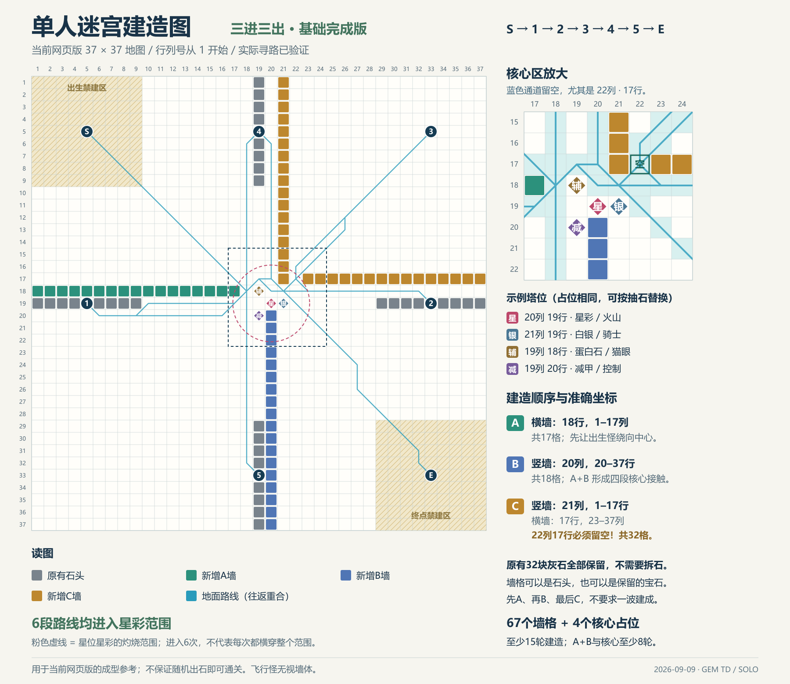

# 单人迷宫建造图

日期：2026-09-09。适用于当前网页版的`dota2-solo-37-v1`地图。

[原始矢量图](images/solo-maze-plan.svg) · [精确坐标与验证结果](solo-maze-plan.json)

这是一张按当前地图与寻路规则绘制的基础成型图，借鉴“让相邻路标之间反复经过中央火力”的三进三出思路，不是原版客户端截图，也不是对某张社区成图的逐格复制。思路参考[17173原创阵型分析（2015-09-28）](https://dota2.17173.com/news/09282015/101627448_all.shtml)，地图依据见[单人地图考据](solo-map-research.md)。

## 照图建造

下表与图片均用游戏界面的 **1基行列号**；JSON内部坐标为0基，后续程序使用时应区分。

| 分组     | 位置                                                                                 | 新增占位 |
| -------- | ------------------------------------------------------------------------------------ | -------: |
| A横墙    | 第18行，第1–17列                                                                     |       17 |
| B竖墙    | 第20列，第20–37行                                                                    |       18 |
| C上竖墙  | 第21列，第1–17行                                                                     |       17 |
| C右横墙  | 第17行，第23–37列                                                                    |       15 |
| 核心示例 | 星彩/火山：20列19行；白银/骑士：21列19行；蛋白石/猫眼：19列18行；减甲/控制：19列20行 |        4 |

**22列17行必须留空**，图中的蓝色路线尤其是中央狭窄通道不要封住。32块原有灰石全部保留。墙格可以由石头或保留的宝石占据；图中塔种是示例，可按随机结果在相同位置选择其他塔。改变占位或在通道加塔后，本文路线和覆盖结果不再自动成立。

推荐按A→B→C推进，四个核心位按抽石逐渐形成。A加示例核心有21个新增占位，六段中的第1、2、5段进入星彩范围；A+B加核心共39个新增占位，第1、2、5、6段进入范围；完整图共71个新增占位，六段全部进入范围。

每轮五次建造，A+B与核心仅按占位下限需8轮，完整图下限15轮。这个下限不计临时摆位、随机材料和其他保留塔所占的额外位置，不能视为每个种子都能按期完成，也不能用完成版预设第10波火力。

## 验证范围

生成器[scripts/draw-solo-maze.ts](../scripts/draw-solo-maze.ts)直接调用当前`findPath`，按八方向移动和现有穿角限制验证。检查所有新增格不重复、不占禁建区或路标，并分别检查A、A+B和完成版全路可达。执行方式：在`game/`运行`npx tsx scripts/draw-solo-maze.ts`，需现有Node依赖和支持中文的系统字体。

完整布局总占位103格，其中原有32格、新增墙67格、示例核心4格。总地面路径约191.34格，空白初始地图约113.66格。

| 路段 | 路径长度（格） | 位于星彩灼烧范围内的路程（格） |
| ---- | -------------: | -----------------------------: |
| S→1  |          32.63 |                           2.46 |
| 1→2  |          30.49 |                           7.38 |
| 2→3  |          28.38 |                           1.73 |
| 3→4  |          31.80 |                           4.25 |
| 4→5  |          28.83 |                           4.80 |
| 5→E  |          39.21 |                          10.02 |

星彩中心为20列19行，半径400/128=3.125格；覆盖路程按每步1000个中点采样近似。六段均有覆盖，**不等于六次完整横穿射程**，也不等于固定六笔伤害。移动速度、减速、灼烧计时、尾伤、怪物技能和其他塔都会影响实际输出。

本图验证的是地面路径与覆盖，不是完整对局通关或最优迷宫证明。飞行怪无视墙，仍需对空火力；闪烁等怪物技能也可能改变实际经历的路程。
